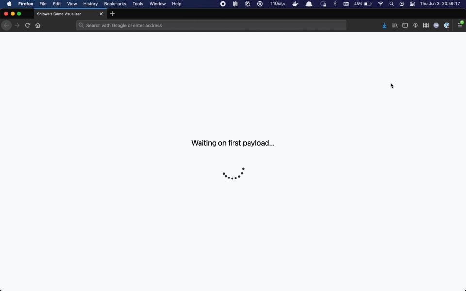

# Shipwars Visualisations

Provides a heatmap visualisation of player and AI shots in realtime.

<div align="center">
	<br>
    
	<br>
  <i>Animation showing player attacks. Dark squares are targeted most.</i>
</div>

## Local Development

Requirements:

* Node.js v14
* npm v6
* Running Shipwars via [this Docker Compose](https://github.com/redhat-gamedev/shipwars-deployment/tree/main/docker)

Once the Shipwars deployment is complete using `docker-compose up`, you can
start this service:

```bash
npm install
npm run start:dev
```

Then navigate to http://localhost:1234/ one browser tab, and
http://localhost:8484/ in another tab. As you play Shipwars at
http://localhost:8484/, the shots taken by you and your opponent will be
visualised as a heatmap.

_NOTE: The application will attempt to connect to a [Shipwars Streams](https://github.com/evanshortiss/shipwars-streams) server at http://localhost:8585/ by default. This can be changed in the package.json, or by providing an override as URL parameter, e.g http://localhost:1234/?url=http://custom.streams-host.com:8585/shot-distribution/stream_

## Building for Production

The following command will create a production build in a *dist/* folder within
the repository.

```bash
npm run build
```

## Building & Pushing a Production Container Image

```bash
# These default values are set by the script, but provided as an example
export IMAGE_TAG=latest
export IMAGE_REPOSITORY=quay.io/evanshortiss

./scripts/build.sh
./scripts/push.sh
```

## Build and Deploy on OpenShift

Use the following command to deploy this service on OpenShift. The command
assumes that you've already deployed the
[Shipwars Streams](https://github.com/evanshortiss/shipwars-streams)
applications in the same OpenShift Project.

```bash
export BUILDER=quay.io/evanshortiss/s2i-nodejs-nginx
export SOURCE=https://github.com/evanshortiss/shipwars-visualisations
export ROUTE=$(oc get route shipwars-streams-shot-distribution -o jsonpath='{.spec.host}')

oc new-app $BUILDER~$SOURCE \
--name shipwars-visualisations \
--build-env STREAMS_API_URL=http://$ROUTE/ \
-l app.kubernetes.io/part-of=shipwars-analysis \
-l app.openshift.io/runtime=nginx

```
